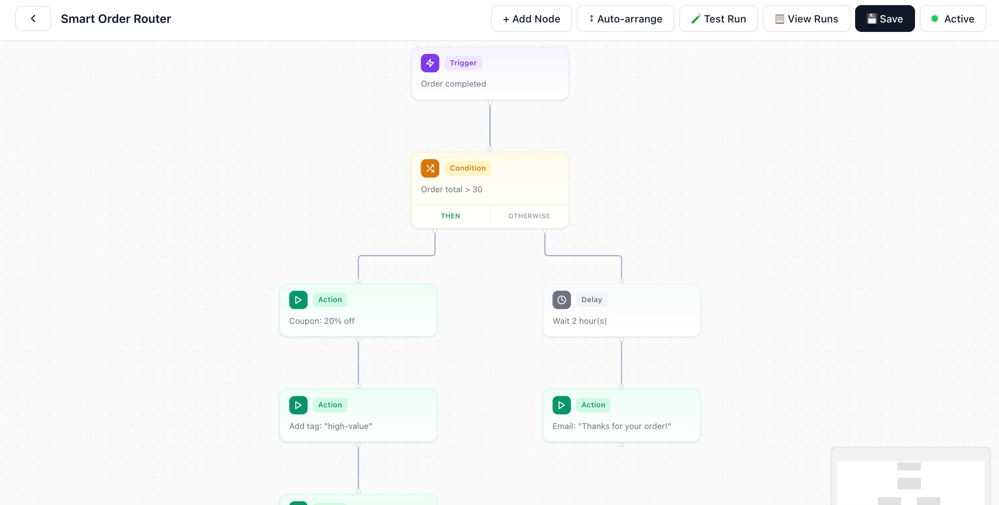
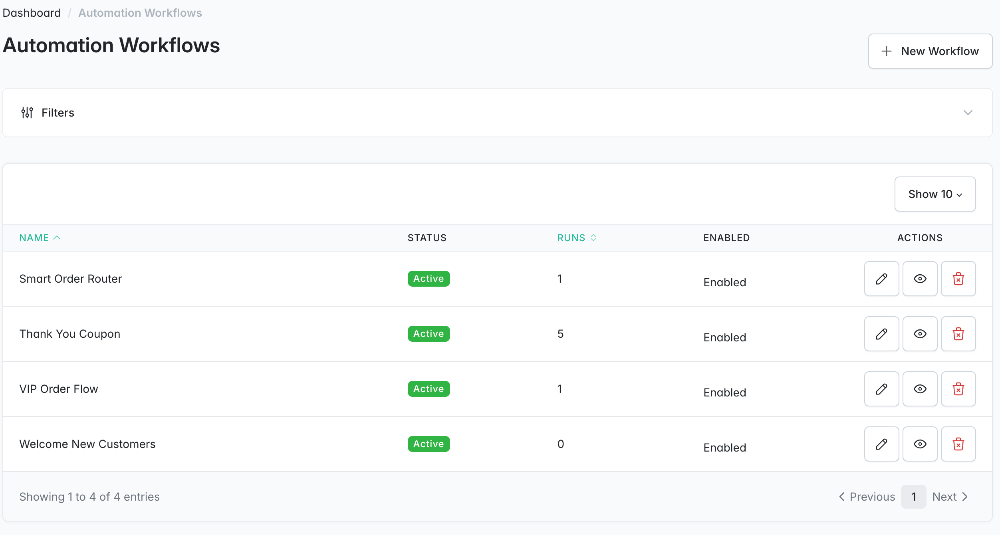
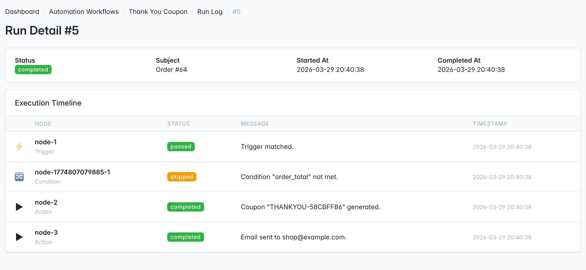

<p align="center">
    <a href="https://sylius.com" target="_blank">
        <picture>
            <source media="(prefers-color-scheme: dark)" srcset="https://media.sylius.com/sylius-logo-800-dark.png">
            <source media="(prefers-color-scheme: light)" srcset="https://media.sylius.com/sylius-logo-800.png">
            
        </picture>
    </a>
</p>

<h1 align="center">Sylius Workflow Plugin</h1>

<p align="center">
    Visual marketing automation engine with a node-based canvas editor for <a href="https://sylius.com">Sylius 2.x</a> stores.
</p>

<p align="center">
    <a href="https://github.com/abderrahimghazali/sylius-workflow-plugin/actions/workflows/ci.yaml"></a>
    <a href="https://packagist.org/packages/abderrahimghazali/sylius-workflow-plugin"></a>
    <a href="https://packagist.org/packages/abderrahimghazali/sylius-workflow-plugin"></a>
    <a href="LICENSE"></a>
    <a href="https://packagist.org/packages/abderrahimghazali/sylius-workflow-plugin"></a>
    <a href="https://packagist.org/packages/abderrahimghazali/sylius-workflow-plugin"></a>
    
</p>

---

## Screenshots

### Canvas Editor — Visual Node-Based Workflow Builder


### Workflow List — Admin Grid


### Run Detail — Execution Timeline


## Features

- **Visual node-based canvas** — drag-and-drop workflow builder powered by React Flow v12
- **4 node types:** Trigger, Condition, Action, Delay — each with color-coded cards and config panels
- **Directed graph execution engine** — walks the graph node by node with full logging
- **8 trigger events:** order.completed, order.cancelled, order.shipped, cart.abandoned, customer.registered, customer.birthday, loyalty.tier_upgraded, payment.failed
- **6 condition rules:** order total, first order, customer tag, customer country, loyalty tier, workflow run count
- **7 action types:** send email, generate coupon, add/remove customer tag, add loyalty points, send webhook, add order note
- **Delay nodes** — deferred execution via Symfony Messenger with DelayStamp (minutes, hours, days, weeks)
- **Deduplication** — SHA-256 hash prevents workflows from double-firing on the same subject per day
- **8 pre-built templates** — abandoned cart recovery, post-purchase review, win-back, birthday coupon, loyalty tier upgrade, welcome, upsell, payment recovery
- **Template browser** — one-click install of pre-built workflows directly from the admin panel
- **Test run** — dry-run mode evaluates conditions without executing actions, highlights execution path on canvas
- **Admin CRUD** — Sylius Grid workflow list with status badges, enabled toggle, and action buttons
- **Run log viewer** — per-workflow execution history with node-by-node timeline and status badges
- **Analytics dashboard** — 30-day stats cards, daily runs chart (Chart.js), per-workflow breakdown table
- **8 email templates** — clean, responsive HTML emails with shared base layout
- **Graceful degradation** — loyalty plugin integration via `class_exists()`, failed actions don't stop the workflow
- **Graph validation** — cycle detection (DFS), trigger count enforcement, edge integrity checks (frontend + backend)
- **No CSS conflicts** — all styles prefixed with `swp-` to avoid Sylius admin clashes

## Requirements

| Requirement | Version |
|-------------|---------|
| PHP | ^8.2 |
| Sylius | ^2.1 |
| Symfony | ^7.0 |
| Node.js | ^20 (for building canvas assets) |

## Installation

1. Require the plugin:

```bash
composer require abderrahimghazali/sylius-workflow-plugin
```

2. Register the bundle in `config/bundles.php` (if not auto-discovered):

```php
return [
    // ...
    Abderrahim\SyliusWorkflowPlugin\SyliusWorkflowPlugin::class => ['all' => true],
];
```

3. Import routes — create `config/routes/sylius_workflow.yaml`:

```yaml
sylius_workflow:
    resource: '@SyliusWorkflowPlugin/config/routes.yaml'
```

4. Generate and run the migration:

```bash
bin/console doctrine:migrations:diff
bin/console doctrine:migrations:migrate
```

5. Build the React canvas assets:

```bash
cd vendor/abderrahimghazali/sylius-workflow-plugin
npm install --prefix assets
npx webpack --mode production
```

Then symlink the built file to your public directory:

```bash
bin/console assets:install public
```

## Usage

### Creating a Workflow

1. Navigate to **Marketing > Automation Workflows** in the admin sidebar
2. Click **New workflow** — enter a name and description
3. You'll be redirected to the **canvas editor** with a default trigger node
4. Add nodes from the **+ Add Node** dropdown (Condition, Action, Delay)
5. Connect nodes by dragging from the **Then** handle to the entry handle
6. Configure each node by clicking it — the right panel shows type-specific fields
7. Click **Save** to validate and persist the graph
8. Toggle **Activate** when ready

### Installing a Template

1. Go to **Marketing > Automation Workflows**
2. Click **Browse Templates** (or navigate to `/admin/workflows/templates`)
3. Browse the 8 pre-built workflows by category
4. Click **Install Template** — creates a draft workflow you can customize before activating

### Test Run

1. Open any workflow in the canvas editor
2. Click **Test Run** in the toolbar
3. Select a subject type (Order or Customer) and enter an ID
4. The dry-run evaluates conditions for real but skips all actions
5. The canvas highlights the execution path: green = passed, amber = skipped

### Run Log

1. From the workflow list, click **View Runs** on any workflow
2. See all execution history with status badges (completed/failed/skipped/running)
3. Click **View Details** to see the node-by-node execution timeline

## Node Reference

### Trigger Events

| Event | Description |
|-------|-------------|
| `order.completed` | Fires when an order is completed |
| `order.cancelled` | Fires when an order is cancelled |
| `order.shipped` | Fires when an order is shipped |
| `cart.abandoned` | Fires when a cart is abandoned |
| `customer.registered` | Fires when a new customer registers |
| `customer.birthday` | Fires on a customer's birthday |
| `loyalty.tier_upgraded` | Fires when a loyalty tier is upgraded |
| `payment.failed` | Fires when a payment fails |

### Condition Rules

| Rule | Operators | Description |
|------|-----------|-------------|
| `order_total` | is, is_not, gt, lt, gte, lte | Compare order total (in cents) |
| `customer_first_order` | is, is_not | Check if this is the customer's first order |
| `customer_tag` | is, is_not, contains | Check customer tags |
| `customer_country` | is, is_not | Check customer address country code |
| `loyalty_tier` | is, is_not | Check loyalty tier name |
| `workflow_run_count` | is, is_not, gt, lt, gte, lte | How many times this workflow ran for this customer |

### Action Types

| Action | Config Fields | Description |
|--------|--------------|-------------|
| `send_email` | template, subject | Send an email via Symfony Mailer |
| `generate_coupon` | promotion, discount, expires_in_days | Create a Sylius promotion coupon |
| `add_customer_tag` | tag | Add a tag to the customer |
| `remove_customer_tag` | tag | Remove a tag from the customer |
| `add_loyalty_points` | amount, reason | Award loyalty points (requires loyalty plugin) |
| `send_webhook` | url, method | Send an HTTP POST/PUT to an external URL |
| `add_order_note` | note | Append a note to the order |

## Built-in Templates

| Template | Trigger | Flow |
|----------|---------|------|
| Abandoned Cart Recovery | cart.abandoned | Wait 1h > Send email |
| Post-Purchase Review | order.completed | Wait 7d > First order? > Send email |
| Win Back Inactive | cart.abandoned | Generate coupon > Send email |
| Birthday Coupon | customer.birthday | Generate coupon > Send email |
| Loyalty Tier Upgrade | loyalty.tier_upgraded | Send email > Add 50 points |
| New Customer Welcome | customer.registered | Wait 1h > Send email |
| Post-Purchase Upsell | order.completed | Wait 3d > First order? > Send email |
| Payment Failed Recovery | payment.failed | Wait 2h > Send email |

## Integration

### Loyalty Plugin

If `abderrahimghazali/sylius-loyalty-plugin` is installed, the **Add Loyalty Points** action dispatches events to it. If not installed, the action logs a warning and skips gracefully.

### Upsell Plugin

The **Post-Purchase Upsell** template works independently but can be enhanced with `abderrahimghazali/sylius-upsell-plugin` for product recommendation data.

## Architecture

```
src/
├── Api/
│   ├── TestRunController.php              # Dry-run test endpoint
│   └── WorkflowGraphController.php        # Save graph JSON endpoint
├── Controller/Admin/
│   ├── AnalyticsController.php            # Analytics dashboard
│   ├── TemplateController.php             # Template browser + install
│   ├── WorkflowCampaignController.php     # CRUD + toggle
│   └── WorkflowRunController.php          # Run log + detail
├── DependencyInjection/
├── Entity/
│   ├── WorkflowCampaign.php
│   ├── WorkflowRun.php
│   └── WorkflowTriggerLog.php
├── Enum/                                   # 4 backed string enums
├── Form/Type/WorkflowCampaignType.php
├── Graph/
│   ├── WorkflowContext.php
│   ├── WorkflowExecutor.php               # Main execution engine
│   ├── WorkflowGraphValidator.php          # Cycle detection + validation
│   ├── DryRunWorkflowExecutor.php          # Test run engine
│   ├── Node/                               # 4 node type classes
│   ├── Rule/                               # RuleInterface + 6 evaluators
│   └── Action/                             # ActionInterface + 7 executors
├── Listener/TriggerListenerManager.php     # Sylius event listener
├── Menu/AdminMenuListener.php
├── Messenger/                              # Delayed execution via Messenger
├── Repository/
├── Template/                               # 8 pre-built workflow templates
└── SyliusWorkflowPlugin.php

assets/workflow-editor/
├── index.js                                # React entry point
├── App.jsx                                 # Canvas + toolbar + panel + test run
├── nodes/                                  # 4 custom React Flow node components
├── panel/                                  # Right config panel components
├── utils/                                  # Serializer, validator, labels
└── styles/nodes.css                        # All styles (swp- prefixed)

templates/
├── admin/                                  # Grid, create, canvas, run log, analytics, templates
└── email/                                  # 8 workflow email templates + base layout
```

## Testing

```bash
# PHP tests
vendor/bin/phpunit

# Static analysis
vendor/bin/phpstan analyse

# Build JS assets
cd assets && npm install && cd .. && npx webpack --mode production
```

## License

MIT. See [LICENSE](LICENSE).
